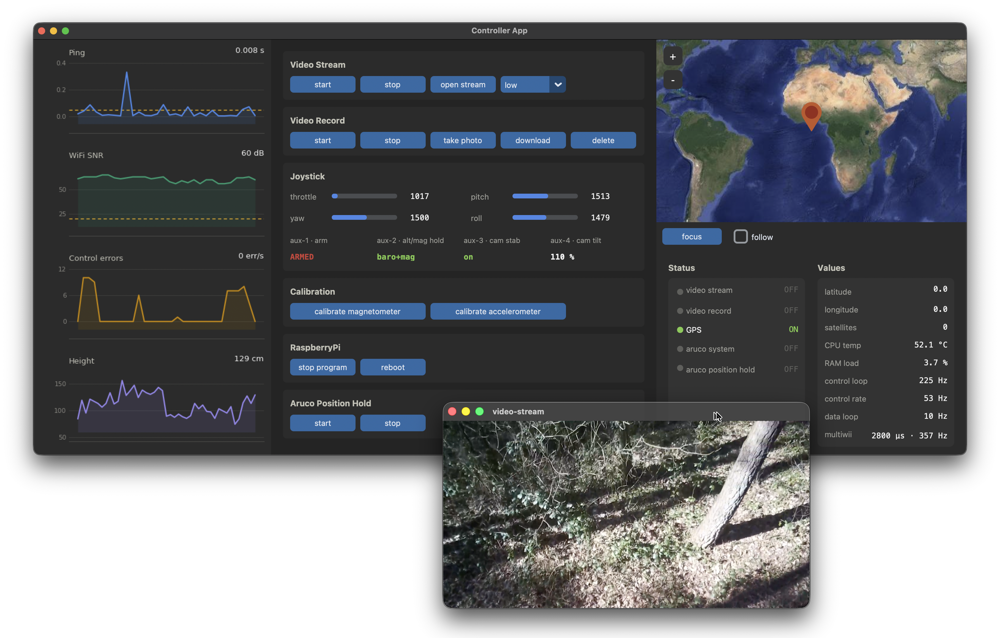

# RaspberryPi Wifi Quadcopter Project

This repository documents the hardware and software developement process
of my private quadcopter project I started in 2019. May this be a helpfull source
of information and inspiration for people with similar ideas.

The controller is MultiWii running on Arduino Micro, which is connected via USB Serial to a RaspberryPi 4 Compute Module with Waveshare Nano Base Board expansion shield. The RaspberryPi creates a Wifi Hotspot and receives control signals which it forwards to the MultiWii controller. The quadcopter is controlled via BetaFPV LiteRadio 2 controller which is connected to the Computer via USB, read by a Python ground station software, which then sends the control signal via UDP to the RaspberryPi. Telemetry is sent back from the RaspberryPi to the ground station in the same way. Video transmission is done using 120 degree ultrawide camera conntected to the Pi and streamed to the Computer using `libcamera-vid` with h264 encoding and direct UDP stream displayed via `mvp` on the Mac Computer. Controller delay is about 1-5ms and video stream delay is about 100-200ms with this setup. Wifi range can be extended to 200-300m using a Wifi adapter with external antenna on the Computer.

The frame is hand-cut from acrylic glass and plastic panels and assembled using screws. The camera is stabilized and controllable in the pitch axis using a micro servo motor conntected to the Arduino flight controller and configured in MultiWii.

https://github.com/TomSchimansky/RaspiDrone/assets/66446067/693bade9-07b2-4246-8f70-a9f16c2e5517

https://github.com/TomSchimansky/RaspiDrone/assets/66446067/2f70f65a-61e4-4c19-a4ac-485b5f99872d

