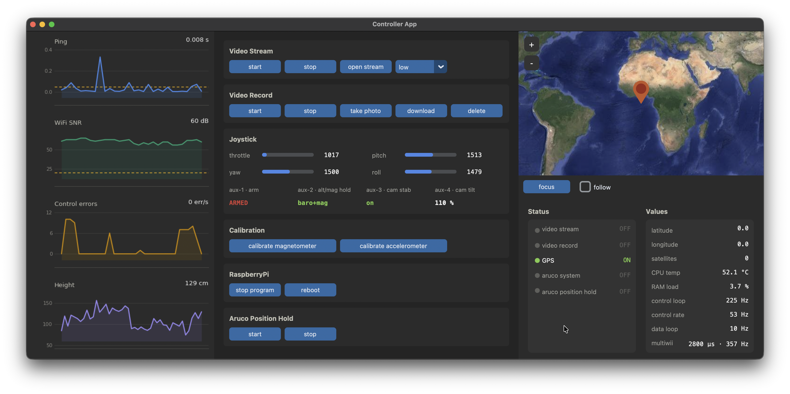

# RaspberryPi Wifi Quadcopter Project

This repository documents the hardware and software developement process
of my private quadcopter project I started in 2019. May this be a helpfull source
of information and inspiration for people with similar ideas.

https://github.com/TomSchimansky/RaspiDrone/assets/66446067/693bade9-07b2-4246-8f70-a9f16c2e5517

https://github.com/TomSchimansky/RaspiDrone/assets/66446067/2f70f65a-61e4-4c19-a4ac-485b5f99872d

